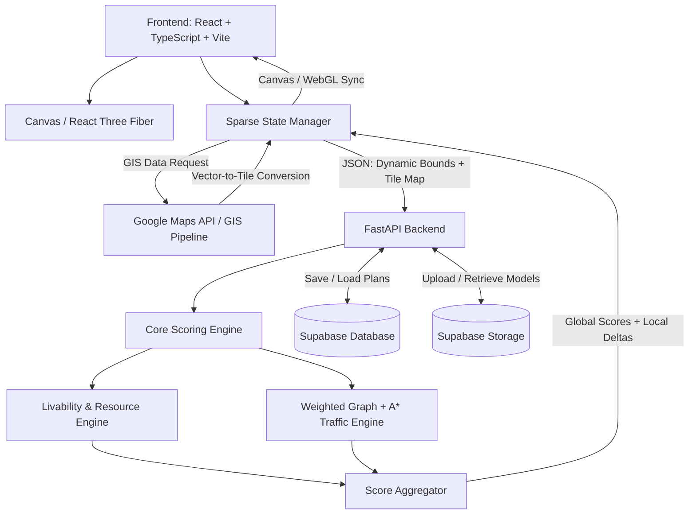

# MetroGrid — Advanced Edition
## Product Requirements Document (PRD)

**Version:** 2.1 — Progressive Prototype-First Edition + Phase 4 Design & Spatial Extension Directives  
**Purpose:** Progressive, prototype-first specification for AI coding agents and human developers; build a working vertical slice first, validate it, then extend it incrementally  
**Target build window:** 48 hours for the first demoable prototype, followed by progressive extensions  
**Primary goal:** Build a polished, minimal, demoable urban simulation prototype first, then progressively extend the same foundation with sparse-grid scaling, richer scoring, GIS ingestion, persistence, and optional 3D assets.

---

## 1. Product Overview

**MetroGrid** is an interactive urban simulation and city-layout planner. Users design cities on an expandable sparse grid by placing residential, commercial, industrial, green, pedestrian, and road infrastructure tiles.

The application provides immediate algorithmic feedback on:

- Livability
- Traffic flow
- Resource accessibility

The advanced edition extends the original 20×20 prototype into an **infinite/extendable sparse coordinate grid**, adds GIS map ingestion, multi-tier road networks with weighted A* pathfinding, and support for `.gltf`/`.glb` custom building models rendered with React Three Fiber.

### 1.1 Core Goal

Provide a fast, visually understandable planning tool that lets users answer:

> "If I change this part of the city, how does the rest of the simulated community respond?"

### 1.2 Hackathon Goal

The implementation must remain deterministic, understandable, and demoable. AI coding agents must not introduce unnecessary dependencies, speculative services, heavyweight ORMs, or undocumented API routes.


## 1.3 Progressive Product Strategy — Prototype First, Then Expand

MetroGrid MUST be developed as a sequence of working increments rather than as a single large implementation.

### Guiding principle

> Build the smallest useful version, prove the core interaction, preserve the architecture, and only then add complexity.

Every phase MUST leave the application in a runnable, demoable state. Later phases extend the previous phase; they do not replace it with a parallel implementation.

### Phase 0 — Foundation and UX Skeleton

Goal: establish the application shell and design language before implementing the full simulation.

Deliver:
- React + TypeScript + Vite application shell.
- Minimal responsive layout.
- City canvas area.
- Compact tile/tool palette.
- Score panel with placeholder values.
- Clear empty state and basic interaction affordances.
- Shared types and project conventions.
- Health-checkable frontend/backend setup.

Exit criteria:
- App starts reliably.
- User can see the planner shell.
- UI feels coherent before advanced functionality is added.

### Phase 1 — Functional Core Prototype / Vertical Slice

Goal: prove the complete basic loop end-to-end with the fewest features.

Deliver:
1. 20×20 compatibility grid or small bounded grid view.
2. Residential, Commercial, Green, Industrial, and Road placement.
3. Erase tool.
4. Deterministic `/api/calculate`.
5. Livability, Traffic, and Resources scores.
6. Local score feedback after placement.
7. Basic responsive score dashboard.

The prototype MUST intentionally defer GIS, Supabase persistence, 3D, infinite coordinates, and advanced road hierarchy.

Exit criteria:
- A user can open the app, place zones, immediately see score changes, remove a tile, and understand why the score changed.
- Backend tests cover the initial scoring rules.
- No core interaction depends on unfinished advanced features.

**Phase 2 — Sparse Grid, Viewport Scaling, and Minimalist Styling Foundation**
Goal: migrate the working prototype to the Advanced Edition's expandable sparse coordinate model while establishing the core minimalist UI styling using available MCPs.

Deliver:

* `Map<string, TileObject>` authoritative state, signed integer coordinates, and world/grid coordinate conversion.


* Pan, zoom, viewport bounds, chunking, and viewport culling.


* Backward-compatible conversion from the Phase 1 representation.


* **Styling Integration:** Utilize MCPs to scaffold the foundational UI layout, ensuring the application of Cline's minimalistic skill.
* **Minimalist UX:** Implement compact tool palettes and score displays, utilizing consistent design tokens (spacing, typography, border radius) without a heavyweight UI framework.


Exit criteria:

* Existing Phase 1 behavior still works, and off-screen theoretical coordinates are never materialized as a full matrix.


* Users can pan and zoom beyond a fixed 20×20 board.


* The UI strictly prioritizes the city canvas above all secondary information, maintaining a small number of persistent controls.


**Phase 3 — Road Intelligence, Persistence, and Styled Advanced Controls**
Goal: make city planning strategically meaningful and persistable while extending the minimalist design language to complex states.

Deliver:

* Road subtypes 40–43, weighted A* traffic connectivity, and congestion estimation.


* Save/load through Supabase.


* Validation, error states, and recovery UX.


* **Styling Integration:** Extend the MCP-driven styling to new UI elements, ensuring error, loading, and disabled states are visually clear without relying on oversized modals.


* **Progressive Disclosure:** Implement compact, inline controls for save/load and road hierarchy selection, hiding them behind an "Advanced" toggle if necessary to keep the primary canvas clear.


Exit criteria:

* Road hierarchy materially affects pathfinding, and scoring remains deterministic.

* Save/load restores the same sparse state.

* New persistence and road tools do not force a redesign of the main planner canvas or cover it with oversized UI.

### Phase 4 — GIS Import, Premium Minimal UI, and Spatial Extensibility

Goal: let users start from real geographic context while upgrading the frontend into a polished, stylish, minimal planning experience and establishing clean extension points for future freeform roads and independently oriented 3D building models.

#### Mandatory Cline Skills

Before implementing Phase 4, Cline MUST inspect and actively use the available:

- **Web Design skill**
- **Frontend skill**

Apply these skills to visual hierarchy, layout composition, responsive behavior, typography, spacing, component architecture, accessibility, interaction design, state design, frontend maintainability, and performance-conscious rendering.

These skills supplement the MetroGrid PRD and MUST NOT override explicit MetroGrid requirements or the existing architecture.

When skill recommendations conflict with the PRD, preserve the PRD and architecture.

#### UI / Design Stack

Use the following technologies selectively and intentionally:

- **shadcn/ui** for accessible, composable UI primitives such as buttons, tooltips, dropdowns, selects, popovers, tabs, compact dialogs, progress/status controls, and form controls.
- **Runway** for visual/design assistance and tasteful visual treatment where it materially improves the product.
- **anime.js** for lightweight, restrained micro-interactions.
- **Watermelon UI** where it provides a useful visual or interaction component compatible with the existing stack.

Do not create multiple competing design systems. Customize components into one coherent MetroGrid visual language.

Before installing anything, inspect the existing dependencies and reuse what is already available where practical.

#### Visual Direction

MetroGrid should feel:

- Minimal
- Premium
- Modern
- Spatial
- Clean
- Focused
- Fast
- Visually understandable

Prioritize the city canvas above secondary information.

Use:

- Strong visual hierarchy
- Compact controls
- Consistent typography
- Consistent spacing
- Subtle borders
- Restrained shadows
- Consistent corner radius
- Clear hover, active, selected, disabled, loading, and error states
- Thoughtful empty states
- Compact contextual feedback

Avoid:

- Dashboard-heavy layouts
- Oversized cards
- Oversized modal dialogs
- Excessive gradients
- Excessive shadows
- Excessive animation
- Decorative UI that does not support planning
- Controls that cover the active city area
- Needless clicks
- Multiple competing toolbars

The application should feel intentionally designed rather than assembled from unrelated component-library defaults.

#### anime.js Interaction Direction

Use anime.js only where it improves feedback or spatial understanding, including where appropriate:

- Tile placement feedback
- Floating score deltas
- Tool-selection transitions
- GIS import transitions
- Score changes
- Success/error feedback
- Subtle UI reveals
- Spatial placement previews

Animations MUST be fast, subtle, non-blocking, performance-conscious, and compatible with `prefers-reduced-motion`.

#### GIS Deliverables

Deliver:

- Map selection UI.
- Bounding-box selection.
- GIS ingestion.
- Coordinate transformation.
- Deterministic rasterization.
- Metadata-to-tile mapping.
- Merge imported data into the existing sparse grid.
- Polished loading, success, partial/empty, validation, failure, and retry states.

GIS MUST remain an extension of the planner, not a separate editing product.

#### GIS User Flow

```text
Open GIS Import
    ↓
Interactive Map
    ↓
Select Bounding Box
    ↓
Validate Bounds
    ↓
Request GIS Data
    ↓
Vector Geometry
    ↓
Coordinate Transformation
    ↓
Deterministic Rasterization
    ↓
Metadata → Tile Types
    ↓
Merge Into Existing Sparse Grid
    ↓
Recalculate Scores
    ↓
Continue Editing
```

The existing city state MUST remain recoverable if GIS import fails.

Prefer a compact GIS button plus a contextual side panel, popover, or sheet rather than a large multi-step wizard. Keep the planner canvas visible whenever reasonably possible.

#### shadcn/ui Requirements

Use shadcn/ui selectively for reusable controls and states. Establish shared MetroGrid tokens for:

- Typography
- Spacing
- Border radius
- Control heights
- Shadows
- Surface/background treatments
- Motion timing
- Focus states

Do not leave default shadcn styling untouched if it conflicts with the MetroGrid visual language.

#### Responsive Design

Use the Web Design and Frontend skills to support desktop, laptop, tablet, and mobile layouts.

On small screens:

- Keep the city canvas dominant.
- Move tools into a compact bottom toolbar where appropriate.
- Collapse advanced controls.
- Avoid permanent side panels consuming most of the viewport.
- Maintain touch-friendly targets.

#### Spatial Extensibility: Freeform Roads

Phase 4 MUST establish an architecture that does not permanently assume roads are axis-aligned grid tiles.

The current road subtype system remains valid and scoring/pathfinding remain deterministic, but rendering and interaction should be designed so future roads can support:

- Horizontal orientation
- Vertical orientation
- Diagonal orientation
- Arbitrary angles
- Curved paths
- Multi-segment geometry
- Variable road widths
- Endpoints and nodes
- Intersections
- Snapping
- Editing

A suitable conceptual extension is:

```typescript
interface RoadGeometry {
  id: string;
  type: number;
  points: Array<{
    x: number;
    y: number;
  }>;
  width?: number;
}
```

This is an extension direction, not permission to unnecessarily replace the authoritative sparse grid during Phase 4.

Road visual orientation must eventually be derived from geometry rather than hard-coded as horizontal/vertical tile artwork.

The road subtype still controls speed/capacity semantics; orientation is visual/spatial data and must not become an arbitrary scoring bonus.

#### Spatial Extensibility: Future Building Model Orientation

When `.glb` / `.gltf` models are introduced, the architecture MUST allow each model to have its own independent transform.

The existing:

```typescript
model_url?: string;
```

may be extended conceptually with transform metadata such as:

```typescript
interface ModelTransform {
  rotation?: {
    x: number;
    y: number;
    z: number;
  };
  scale?: {
    x: number;
    y: number;
    z: number;
  };
  positionOffset?: {
    x: number;
    y: number;
    z: number;
  };
}
```

Requirements:

- Each model can have its own rotation.
- Building orientation is independent of tile orientation.
- Models may face roads or other directions.
- Rotation is stored as data, not temporary UI state.
- Transform metadata remains separate from simulation/scoring semantics.
- A failed model load MUST NOT corrupt the city state.

Do not expose complex rotation tooling in the main UI during Phase 4 unless needed. Establish clean extension points without premature over-engineering.

#### Spatial Object Principle

Prepare the frontend around:

```text
Tile Position
+
Optional Geometry
+
Optional Visual Transform
=
Rendered Spatial Object
```

This should permit future:

- Freeform roads
- Rotated buildings
- Variable building dimensions
- Curved infrastructure
- GIS-derived vector geometry
- Rich 3D assets

without rewriting the city-state architecture.

#### Interaction Direction

The core flow remains:

```text
Select Tool
    ↓
Place
    ↓
See Consequence
```

Future expressive placement should remain compatible with:

```text
Road:
Start → Draw/Drag Path → Adjust Geometry → Commit

Building:
Select → Place → Rotate/Adjust Orientation → Commit
```

Do not implement a complicated geometry editor merely for Phase 4 appearance.

#### Error and Safety UX

The interface MUST gracefully handle:

- Backend unavailable
- GIS import failure
- Invalid bounds
- Empty GIS results
- Invalid placement
- Invalid model
- Model loading failure
- Save failure
- Load failure
- Invalid API response

Errors should be visible without crashing the planner or replacing the current city.

#### Performance

Visual polish MUST NOT compromise:

- Sparse state
- Chunking
- Viewport culling
- Minimal React re-renders
- Canvas batching
- 60 FPS normal viewport interaction target
- Lazy model loading

Prefer CSS transforms, targeted DOM animation, and localized anime.js animations for UI effects.

Do not introduce a heavyweight 2D rendering abstraction.

#### Accessibility

All Phase 4 UI MUST:

- Maintain keyboard-focus visibility.
- Provide text alternatives/tooltips for icon-only actions.
- Preserve readable contrast.
- Provide non-color cues for score state.
- Support desktop and mobile viewport sizes.
- Respect reduced-motion preferences.

#### Phase 4 Exit Criteria

- A selected geographic area can be imported and edited using the same planner tools.
- GIS failure never destroys the current city.
- The interface is substantially more polished, stylish, and minimal while remaining canvas-first.
- Web Design and Frontend skills are visibly reflected in layout, UX, responsiveness, accessibility, and component quality.
- shadcn/ui is integrated appropriately.
- Runway and Watermelon UI are used selectively where beneficial.
- anime.js provides restrained, useful micro-interactions.
- The architecture is ready for future freeform road geometry.
- The architecture is ready for future independently oriented building models.
- Existing Phase 1–3 behavior remains functional.
- Core tests pass.
- The Phase 4 demo flow can be completed reliably.


### Phase 5 — Day 2 / Freeform Spatial Placement

**Goal:** Remove the assumption that planning objects must be snapped to a grid. Preserve the sparse city model as the authoritative data layer, but allow real spatial placement.

**Deliver:**

- Freeform placement for zones at arbitrary world coordinates.
- Zone rotation at any angle.
- Zone footprint/size editing without requiring grid-aligned dimensions.
- Visual placement preview before commit.
- Move existing zones without deleting/recreating them.
- Rotate existing zones after placement.
- Collision/overlap feedback that is clear but does not unnecessarily prevent valid planning.
- Selection, move, rotate, resize, and delete interactions.
- Undo/redo for spatial edits.
- Backward compatibility for existing sparse-grid data.
- A clean distinction between:
  - logical zone type;
  - world position;
  - footprint geometry;
  - visual transform;
  - simulation attributes.

**Important architectural rule:**

The grid remains useful as a coordinate/reference system and for compatibility, but it is no longer a restriction on where zones can exist. Do not force freeform objects back onto integer tile centers.

A suitable conceptual model is:

```typescript
interface SpatialZone {
  id: string;
  type: ZoneType;
  position: { x: number; y: number };
  rotation: number;
  footprint: {
    width: number;
    depth: number;
  };
  attributes: ZoneAttributes;
}
```

**Exit criteria:**

- A user can place a zone anywhere in the planning space.
- A user can rotate a zone to any angle.
- A user can select and transform an existing zone.
- Existing Phase 1–4 functionality remains usable.
- Spatial transforms are stored in city state rather than temporary UI state.
- Scoring can consume spatial objects without depending on visual rendering.

---

### Phase 6 — Day 2 / Freeform Road Authoring

**Goal:** Replace grid-only road placement with a real road-drawing workflow while retaining deterministic traffic semantics.

**Deliver:**

- Draw roads by clicking/dragging a path.
- Multi-segment road geometry.
- Straight and curved road segments.
- Arbitrary orientation.
- Adjustable road width.
- Road endpoints and editable nodes.
- Move/add/delete control points.
- Split and merge compatible road segments where practical.
- Road intersections generated from actual geometric intersections.
- Road selection and modification after creation.
- Preserve road subtype semantics:
  - pedestrian path;
  - local road;
  - transit avenue;
  - express highway.
- Road subtype controls speed/capacity semantics; geometry does not become an arbitrary score bonus.
- A deterministic conversion from freeform road geometry into the traffic graph.

Conceptual model:

```typescript
interface RoadGeometry {
  id: string;
  type: RoadType;
  points: Array<{ x: number; y: number }>;
  width: number;
  elevation: number;
  attributes?: RoadAttributes;
}
```

**Interaction flow:**

```text
Select Road Tool
      ↓
Click / Drag to Draw
      ↓
Preview Geometry
      ↓
Adjust Nodes / Width / Type
      ↓
Commit
      ↓
Rebuild A* Graph
      ↓
Recalculate Scores
```

**Exit criteria:**

- A user can draw a road without snap-to-grid.
- Roads can be diagonal, curved, and multi-segment.
- Existing roads can be selected and modified.
- Traffic/pathfinding uses road geometry deterministically.
- The planner remains responsive during road editing.

---

### Phase 7 — Day 2 / Zone Attributes and Existing-Zone Editing

**Goal:** Turn zones into editable planning entities rather than fixed colored tiles.

**Deliver:**

- Create zone attributes at placement time.
- Edit attributes of newly created zones.
- Edit attributes of imported or pre-existing zones.
- Select an existing zone and open an inspector.
- Update attributes without recreating the zone.
- Support at minimum:

```text
Zone Type
Name / Label
Capacity or Density
Height / Floors
Footprint
Rotation
Development Intensity
Optional Custom Model
```

- Attribute changes immediately update the simulation.
- Attribute editing must work for both manually created and GIS-derived zones.
- Reset/restore defaults where appropriate.
- Unsaved modifications remain recoverable.

Conceptual model:

```typescript
interface ZoneAttributes {
  name?: string;
  density?: number;
  capacity?: number;
  floors?: number;
  height?: number;
  developmentIntensity?: number;
}
```

**UX requirement:**

Do not open a large form by default. Selecting a zone should reveal a compact inspector or contextual panel near the selected object.

**Exit criteria:**

- Existing zones can be modified without deletion.
- Attribute edits change simulation results.
- Imported zones are editable using the same inspector.
- State serialization preserves attributes.

---

### Phase 8 — Day 2 / Terrain and Elevation

**Goal:** Introduce terrain as a first-class spatial layer that affects both visualization and simulation.

**Deliver:**

- Terrain editing mode.
- Raise terrain locally.
- Lower terrain locally.
- Brush-based terrain editing.
- Adjustable brush radius.
- Adjustable edit strength.
- Terrain preview before commit.
- Persistent terrain elevation data.
- Smooth/interpolate terrain changes where practical.
- Display elevation or contour information when useful.
- Terrain must influence scoring where specified by the simulation model.

Conceptual model:

```typescript
interface TerrainCell {
  x: number;
  y: number;
  elevation: number;
}
```

For freeform spatial objects, use sampled/interpolated terrain elevation rather than forcing every object onto a single flat grid height.

**Simulation requirements:**

Terrain elevation can affect:

- road traversal cost;
- accessibility;
- drainage or flood-related penalties if later introduced;
- development suitability;
- building placement constraints;
- terrain-dependent livability/resource effects when explicitly defined.

Do not invent arbitrary terrain penalties. Any scoring effect must be centralized in deterministic configuration/constants and covered by tests.

**Exit criteria:**

- Users can raise and lower terrain.
- Terrain state persists.
- Building and road placement can read terrain elevation.
- Score calculations measurably respond to defined terrain effects.
- Terrain editing does not corrupt existing city objects.

---

### Phase 9 — Day 2 / Multi-Level Infrastructure

**Goal:** Allow infrastructure to exist above and below the surface so cities can model elevated roads, tunnels, and stacked transportation networks.

**Deliver:**

- Road elevation/level property.
- Positive levels for elevated roads.
- Zero level for surface roads.
- Negative levels for underground/tunnel roads.
- Vertical connectors/ramps where needed.
- Level-aware road graph.
- Same x/y coordinates may contain multiple valid road levels.
- Visual separation of stacked infrastructure.
- Clear selection and editing of road levels.
- Deterministic pathfinding across level changes.

Conceptual model:

```typescript
interface RoadGeometry {
  id: string;
  type: RoadType;
  points: Array<{ x: number; y: number }>;
  width: number;
  elevation: number;
  level: number;
  attributes?: RoadAttributes;
}
```

Traffic graph concept:

```text
Surface Road
     │
     │ Ramp / Connector
     ↓
Elevated Road
     │
     │ Connector
     ↓
Underground Road
```

**Rules:**

- Roads at different levels must not automatically intersect.
- A geometric crossing at different levels is not an intersection.
- Vertical connectivity must be represented explicitly by ramps/connectors or equivalent graph edges.
- Level is infrastructure state, not a direct score bonus.
- Pathfinding must remain deterministic.

**Exit criteria:**

- Users can create above-ground and below-ground roads.
- Stacked roads can cross without creating false intersections.
- Valid ramps/connectors enable movement between levels.
- Weighted A* understands the multi-level network.
- Score calculations remain deterministic.

---

### Phase 10 — Day 2 / Professional Spatial Interaction and Planner Rework

**Goal:** Make the planner itself feel like the MetroGrid introduction in `LandingPage.tsx`, while preserving the existing usability of the application.

The planner MUST visually inherit the language already established by the landing-page introduction rather than introducing a separate dashboard-style design.

The provided `LandingPage.tsx` establishes the following visual language:

- "URBAN SYSTEMS" / numbered scene-style eyebrow labels.
- Large editorial headlines with emphasized italic text.
- Dark spatial canvas.
- Thin technical frame lines.
- Monospace metadata.
- Compact status chrome such as `LIVE MODEL`.
- Sparse city geometry.
- Subtle grid.
- Dark building masses.
- Restrained green/blue analytical accents.
- Small floating contextual overlays.
- Compact navigation and actions.
- Animated but controlled camera/spatial movement.
- `anime.js`-based transitions.
- Strong emphasis on the city model rather than dashboard cards.

fileciteturn1file1L11-L19

The planner should therefore look like the **working application version of the landing-page city model**, not like a generic admin dashboard.

#### Planner visual target

```text
┌──────────────────────────────────────────────────────────────┐
│ METROGRID                         LIVE MODEL        82 74 91 │
│                                                              │
│                                                              │
│                    CITY / SPATIAL MODEL                      │
│                                                              │
│       ┌───────┐                      ┌──────────────┐        │
│       │       │──────── ROAD ────────│              │        │
│       │ZONE   │                      │    ZONE      │        │
│       └───────┘                      └──────────────┘        │
│                                                              │
│                        +10 LIVABILITY                        │
│                                                              │
│──────────────────────────────────────────────────────────────│
│  SELECT   ZONE   ROAD   TERRAIN   ANALYZE        3D         │
└──────────────────────────────────────────────────────────────┘
```

#### App/planner requirements

- Use the same visual vocabulary as `LandingPage.tsx`.
- Reuse compatible typography, spacing, iconography, borders, status indicators, and motion principles.
- Keep the city model visually dominant.
- Treat the planner as a spatial workspace rather than a dashboard.
- Use compact floating controls instead of large permanent cards.
- Use technical metadata labels where useful, e.g.:
  - `LIVE MODEL`
  - `CITY / EAST DISTRICT`
  - `ELEVATION`
  - `NETWORK / ACTIVE`
  - `SIMULATION / RUNNING`
- Use small contextual inspectors for selected zones, roads, and terrain.
- Maintain clear hierarchy without filling the screen with panels.
- Use the existing landing-page dark spatial aesthetic as the primary reference.
- The landing page and planner should feel like two views of one product.

The planner MUST NOT simply copy the landing page's scroll narrative. It should convert its visual language into a functional workspace.

#### Interaction language

Use the landing-page interaction principles:

```text
Hover
  ↓
Subtle highlight

Select
  ↓
Spatial outline + contextual information

Place
  ↓
Preview + commit

Change
  ↓
Immediate simulation response

Score change
  ↓
Small animated delta

Inspect
  ↓
Compact contextual panel
```

The city itself should remain the visual centerpiece.

#### LandingPage-to-Planner consistency

The following elements should be shared where practical:

```text
Theme tokens
Typography
Color tokens
Icon style
Border language
Status indicators
Motion timing
Grid treatment
Spatial overlays
Metadata labels
Button treatment
```

Do not duplicate visual constants across unrelated components.

#### Exit criteria

- Opening `/planner` feels like entering the city model shown on the introduction.
- There is a clear visual relationship between `LandingPage.tsx` and the working planner.
- The planner no longer looks like a generic dashboard or game UI.
- New freeform, terrain, and multi-level tools fit the same visual language.
- Existing core workflows remain understandable without reading documentation.
- The UI remains responsive and accessible.

---

### Progressive implementation rule

At the end of every phase:

1. Run the application.
2. Run automated tests.
3. Manually exercise the primary workflow.
4. Verify no regression in previous capabilities.
5. Commit a stable milestone.
6. Update documentation and architecture notes.
7. Only then begin the next phase.

Day 2 features MUST be implemented in the order:

```text
Phase 5  → Freeform Zones
   ↓
Phase 6  → Freeform Roads
   ↓
Phase 7  → Zone Attributes
   ↓
Phase 8  → Terrain
   ↓
Phase 9  → Multi-Level Roads
   ↓
Phase 10 → Planner Visual Rework
```

The sequence may only be changed when a concrete technical dependency requires it. Cline must document that dependency before changing the order.

---

# 2. Product Scope

## 2.1 MVP / Core Features

1. Interactive grid-based city planner.
2. Residential, commercial, green, industrial, and road placement.
3. Real-time scoring through FastAPI.
4. Livability, traffic, and resource scores normalized to 0–100.
5. A* road connectivity/pathfinding.
6. Local score feedback at the latest placement.
7. Save/load city layouts through Supabase.
8. Responsive dashboard with score bars.

## 2.2 Advanced Features

1. Sparse coordinate-map grid replacing the fixed 20×20 matrix.
2. Dynamic viewport/chunk rendering.
3. Signed 32-bit grid coordinates.
4. Google Maps-based bounding-box selection.
5. GIS building/road ingestion pipeline.
6. Latitude/longitude → discrete grid rasterization.
7. Multi-tier road subtypes.
8. Road-specific speed/capacity weights.
9. React Three Fiber / Three.js 3D rendering.
10. `.gltf` and `.glb` model uploads.
11. Supabase Storage asset hosting.
12. Tile-level custom model references.

---

# 3. System Architecture



---

# 4. Technology Stack

## 4.1 Frontend

- React 18+
- TypeScript
- Vite
- TailwindCSS
- Native HTML5 Canvas for 2D grid rendering
- React Three Fiber / Three.js for advanced 3D mode
- `@supabase/supabase-js` for client-side Supabase operations when appropriate
- `shadcn/ui` for accessible, composable UI primitives where appropriate
- `anime.js` for restrained interaction animation where appropriate
- Runway and Watermelon UI may be used selectively where they materially improve the interface

### Frontend directives

- Do not use Fabric.js, PixiJS, or another heavyweight 2D canvas abstraction.
- Keep grid state in a sparse coordinate map.
- Use chunking/viewport culling so off-screen tiles are not rendered.
- Avoid duplicating the authoritative city state across multiple stores.
- Canvas coordinate conversion must use `getBoundingClientRect()`.
- 3D rendering is an extension of the planner, not a requirement for the basic 2D workflow.

## 4.2 Backend

- Python 3.10+
- FastAPI
- Pydantic
- `supabase-py` where backend Supabase access is required

### Backend directives

- Validate every API payload with Pydantic.
- Keep algorithmic processing in active memory.
- Do not introduce a heavy ORM.
- Core calculations must be deterministic and synchronous for the scoring endpoint.
- Do not invent external APIs or routes beyond this specification.

## 4.3 Infrastructure

- Supabase PostgreSQL
- Supabase Storage
- Google Maps Platform for map selection/geocoding
- Optional Overpass/OpenStreetMap-compatible GIS pipeline for building footprints and road vectors, subject to API availability and applicable usage requirements.

---

# 5. Grid Architecture

## 5.1 Evolution from Prototype

The original prototype uses a fixed:

```text
20 × 20 number[][]
```

The Advanced Edition replaces this with:

```text
Map<string, TileObject>
```

The key format is:

```text
"x,y"
```

Example:

```json
{
  "10,-5": {
    "type": 1
  },
  "11,-5": {
    "type": 41
  }
}
```

The sparse map is the authoritative representation in Advanced Edition.

## 5.2 Coordinate System

Each tile uses signed 32-bit integer coordinates:

```text
x: -2147483648 to 2147483647
y: -2147483648 to 2147483647
```

Coordinates must remain integers.

No full matrix should be allocated for the entire coordinate range.

## 5.3 Tile Object

Base representation:

```typescript
interface TileObject {
  type: number;
  model_url?: string;
}
```

Example:

```json
{
  "x": 10,
  "y": -5,
  "type": 1,
  "model_url": "https://example.supabase.co/storage/v1/object/public/models/model.glb"
}
```

## 5.4 Tile Types

### Base Zones

| Type | Meaning |
|---:|---|
| 0 | Empty / Unzoned |
| 1 | Residential |
| 2 | Commercial |
| 3 | Green Space / Park |
| 5 | Heavy Industrial |

### Road Infrastructure

The original type `4` represents generic road infrastructure.

Advanced Edition introduces road subtypes:

| Type | Road | Speed Weight | Throughput |
|---:|---|---:|---|
| 40 | Pedestrian Path | 1 | Low |
| 41 | Local 2-Lane Road | 3 | Medium |
| 42 | 4-Lane Transit Avenue | 5 | High |
| 43 | Express Highway | 10 | Very High |

Type `4` may remain supported as a generic/legacy road type and should map to a sensible default road weight.

---

# 6. Viewport and Chunk Rendering

The application must not attempt to render the complete theoretical coordinate space.

## 6.1 Visible Bounds

The frontend calculates:

```text
minX
maxX
minY
maxY
```

from the current camera/canvas viewport.

Only tiles intersecting the active viewport should be rendered.

## 6.2 Chunking

The implementation should divide the sparse coordinate space into logical chunks.

A chunk may be represented by:

```text
chunkX = floor(x / CHUNK_SIZE)
chunkY = floor(y / CHUNK_SIZE)
```

`CHUNK_SIZE` should be configurable rather than hard-coded throughout the application.

## 6.3 Rendering Rules

- Empty tiles do not need persistent objects in the sparse map.
- Only visible chunks are rendered.
- Pan/zoom must not require rebuilding the entire city.
- Tile updates should invalidate only affected chunks where practical.

---

# 7. GIS / Google Maps Import

## 7.1 User Flow

1. User opens GIS import mode.
2. Google Maps widget displays the map.
3. User selects a rectangular geographic bounding box.
4. Frontend sends the bounds and desired grid origin to the backend.
5. Backend obtains building footprints and road polylines from the configured GIS pipeline.
6. Spatial rasterization converts geographic coordinates to integer grid coordinates.
7. Metadata is used to infer tile types.
8. Imported tiles are merged into the sparse grid.
9. The frontend renders the imported area.
10. Scores are recalculated.

## 7.2 Google Maps Integration

Required capabilities:

- Interactive map display.
- Bounding-box selection.
- Latitude/longitude bounds.
- Geocoding where required.

The application must not expose secret API keys in server-generated client code or source control.

## 7.3 GIS Processing Pipeline

```text
Google Maps / GIS Selection
        ↓
Bounding Box
        ↓
GIS Building + Road Data
        ↓
Vector Geometry
        ↓
Coordinate Transformation
        ↓
Grid Rasterization
        ↓
Tile Type Assignment
        ↓
Sparse Tile Map
```

## 7.4 Rasterization

The backend converts latitude/longitude coordinates into grid coordinates relative to:

```json
{
  "grid_origin": {
    "x": 0,
    "y": 0
  }
}
```

The transformation must be deterministic for the same bounds, origin, and source geometry.

## 7.5 Metadata Mapping

Initial mapping:

```text
Residential → type 1
Commercial → type 2
Green / Park → type 3
Generic Road → type 4
Pedestrian Path → type 40
Local Road → type 41
Transit Avenue → type 42
Express Highway → type 43
Industrial → type 5
```

Unknown GIS metadata must fall back safely rather than creating unsupported tile types.

---

# 8. Multi-Tier Road Network

## 8.1 Road Graph

The traffic engine constructs a weighted graph from connected road tiles.

Each traversable road tile becomes a graph node.

Adjacent compatible road tiles become graph edges.

## 8.2 Road Weights

Higher road speed weights represent faster traversal.

```text
40 → weight 1
41 → weight 3
42 → weight 5
43 → weight 10
```

The exact edge-cost formula may incorporate:

- Road speed weight
- Distance
- Capacity
- Congestion

but must remain deterministic.

## 8.3 Express Highway Restrictions

Type `43` is access-restricted.

A highway tile should not automatically be treated as accessible from every neighboring non-road tile.

Access should occur through valid road connections/ramps.

If ramps are represented explicitly in a future version, they must be modeled as their own tile type or connection metadata rather than inferred unpredictably.

---

# 9. Core Scoring Engine

The scoring endpoint must synchronously calculate the city metrics.

## 9.1 Score Categories

All scores are normalized to:

```text
0–100
```

Higher is better.

The dashboard displays:

- Livability
- Traffic
- Resources

## 9.2 Resource Connectivity

For every Residential tile (`1`):

1. Perform a Manhattan-distance scan.
2. Search for a Commercial tile (`2`) within a radius of 4.
3. If no Commercial tile is found:
   - Apply a `-20` resource penalty.

Manhattan distance:

```text
distance = abs(x1 - x2) + abs(y1 - y2)
```

## 9.3 Green-Space Modifier

For every Green Space (`3`):

- Residential zones within Manhattan radius 3 receive:
  - `+10 Livability`

## 9.4 Industrial Modifier

For every Heavy Industrial zone (`5`):

- Residential zones within Manhattan radius 4 receive:
  - `-15 Livability`

## 9.5 Traffic Connectivity

The engine must verify road connectivity between Residential and Commercial zones.

A Residential zone is considered connected when a valid road path can reach a Commercial zone.

For each Residential zone that cannot reach a Commercial zone:

```text
Traffic penalty = -5
```

## 9.6 Weighted A*

Traffic pathfinding uses an A* variant.

Conceptually:

```text
f(n) = g(n) + h(n)
```

where:

- `g(n)` = accumulated weighted road cost
- `h(n)` = admissible grid-distance heuristic adjusted for the road model

The implementation must not confuse road speed weight with a raw score bonus.

## 9.7 Congestion

Advanced traffic simulation should estimate congestion using:

```text
demand / capacity
```

where demand is derived from connected residential density and capacity is determined by road subtype.

Conceptual capacities:

```text
40 → Low
41 → Medium
42 → High
43 → Very High
```

Exact numeric capacity values should be centralized in configuration/constants.

---

# 10. Score Normalization

Raw scores must never be sent directly to the frontend.

Each metric must be clamped:

```text
normalized = max(0, min(100, normalized_value))
```

The normalization strategy must be consistent between requests.

The frontend should treat scores as:

```typescript
number // 0 to 100
```

---

# 11. Local Decision Feedback

Every scoring request includes the latest user action.

Example:

```json
{
  "x": 10,
  "y": -5,
  "type": 3
}
```

The backend returns a local delta describing the most relevant score change.

Example:

```json
{
  "x": 10,
  "y": -5,
  "value": 10,
  "metric": "livability"
}
```

The frontend displays feedback directly over the changed tile:

```text
+10 Livability
-15 Livability
+10 Resources
```

The feedback must:

1. Appear at the latest placement.
2. Float upward.
3. Fade out.
4. Avoid blocking subsequent interactions.

Implementation may use either:

- CSS keyframe animation over the canvas, or
- Canvas-rendered animated text.

---

# 12. API Contracts

## 12.1 Calculate Scores

### Endpoint

```http
POST /api/calculate
```

### Advanced Request

```json
{
  "active_bounds": {
    "min_x": -10,
    "max_x": 20,
    "min_y": -10,
    "max_y": 20
  },
  "tiles": {
    "0,0": {
      "type": 1
    },
    "0,1": {
      "type": 41
    },
    "0,2": {
      "type": 42
    }
  },
  "latest_action": {
    "x": 0,
    "y": 0,
    "type": 1
  }
}
```

### Response

```json
{
  "global_scores": {
    "livability": 82,
    "traffic": 74,
    "resources": 91
  },
  "local_deltas": {
    "x": 0,
    "y": 0,
    "value": 10,
    "metric": "livability"
  }
}
```

## 12.2 GIS Import

### Endpoint

```http
POST /api/gis/import
```

### Request

```json
{
  "bounds": {
    "north": 12.98,
    "south": 12.97,
    "east": 80.25,
    "west": 80.24
  },
  "grid_origin": {
    "x": 0,
    "y": 0
  }
}
```

### Response

```json
{
  "tiles_imported": 123,
  "updated_grid": {
    "0,0": {
      "type": 41
    },
    "1,0": {
      "type": 2
    }
  }
}
```

## 12.3 Asset Upload

### Endpoint

```http
POST /api/assets/upload
```

### Requirements

- Accept `.glb` and `.gltf`.
- Validate file type.
- Upload to Supabase Storage.
- Return a stable model URL/reference.
- Reject unsupported file types.
- Do not trust a client-provided MIME type alone.

### Tile Reference

```json
{
  "x": 10,
  "y": -5,
  "type": 1,
  "model_url": "https://.../model.glb"
}
```

---

# 13. Backward-Compatible Prototype API

The initial 20×20 prototype contract may be retained during migration.

### Prototype request

```json
{
  "grid_state": [
    [0, 0, 1],
    [0, 2, 4]
  ],
  "latest_placement": {
    "x": 0,
    "y": 0,
    "type": 1
  }
}
```

The migration layer may convert this matrix into sparse coordinates internally.

The Advanced Edition must use the sparse coordinate representation internally.

---

# 14. Frontend Interaction

## 14.1 Placement

The original prototype may use snap-to-grid for simplicity, but Advanced/Day 2 spatial editing MUST NOT require snapping.

Users must be able to:

- place zones at arbitrary world coordinates;
- rotate zones to arbitrary angles;
- move and resize existing zones;
- draw roads along arbitrary paths;
- edit terrain continuously;
- create infrastructure at multiple vertical levels.

Mouse/touch coordinates must be converted using:

```typescript
const rect = canvas.getBoundingClientRect();

const x = event.clientX - rect.left;
const y = event.clientY - rect.top;
```

These screen coordinates are then transformed into world coordinates using:

- camera offset;
- zoom;
- spatial transform;
- terrain/elevation where relevant.

The grid remains a reference/data-compatibility mechanism, not a placement restriction.

## 14.2 Placement Flow

```text
Pointer Event
    ↓
Canvas Bounding Rect
    ↓
Screen → World Coordinates
    ↓
Spatial Hit Test / Placement Preview
    ↓
Commit Spatial Object
    ↓
Update Authoritative City State
    ↓
POST /api/calculate
    ↓
Receive Scores + Delta
    ↓
Update Spatial Analytics
    ↓
Animate Local Feedback
```

For roads:

```text
Pointer Down
    ↓
Draw Path
    ↓
Preview Geometry
    ↓
Adjust Nodes / Width / Level
    ↓
Commit Road
    ↓
Rebuild Traffic Graph
    ↓
Recalculate Scores
```

## 14.3 Interaction States

The UI should support at minimum:

- Select tool/object
- Place zone
- Move zone
- Rotate zone
- Resize zone
- Edit zone attributes
- Draw road
- Edit road nodes
- Change road width/type/level
- Erase/delete object
- Raise terrain
- Lower terrain
- Adjust terrain brush
- Pan viewport
- Zoom viewport
- Undo/redo
- Save layout
- Load layout
- GIS import
- 2D / spatial view
- Optional 3D model placement

---


## 14A. Minimalistic UI / UX Requirements

MetroGrid MUST use a minimalistic, user-first interface. The product should feel like a focused planning tool, not an admin dashboard.

### Design principles

- Prioritize the city canvas above all secondary information.
- Keep the number of persistent controls small.
- Make the current tool obvious.
- Prefer icons + short labels over large panels of text.
- Use progressive disclosure for advanced capabilities.
- Avoid modal dialogs when an inline control can do the job.
- Keep the primary interaction within one or two clicks.
- Do not cover the active city area with oversized UI.
- Provide clear hover, active, selected, disabled, loading, and error states.
- Use consistent spacing, typography, border radius, and icon treatment through shared design tokens.

### Primary layout

Recommended desktop structure:

```text
┌─────────────────────────────────────────────────────────────┐
│ MetroGrid                         Scores: 82 74 91   Save   │
├───────────────┬─────────────────────────────────────────────┤
│ Tools         │                                             │
│ ◯ Select      │                                             │
│ □ Residential │                 CITY CANVAS                 │
│ □ Commercial  │                                             │
│ □ Park        │                                             │
│ □ Industrial  │                                             │
│ ═ Road        │                                             │
│               │                                             │
│ Advanced ▾    │                                             │
└───────────────┴─────────────────────────────────────────────┘
```

Recommended mobile structure:

```text
┌───────────────────────┐
│ MetroGrid       82 74 │
│                       │
│      CITY CANVAS      │
│                       │
│                       │
├───────────────────────┤
│ [Select][Road][Park]  │
│ [Res][Comm][Ind]      │
└───────────────────────┘
```

### Information hierarchy

1. City canvas and current action.
2. Global score summary.
3. Tool selection.
4. Contextual feedback.
5. Advanced features such as GIS, save/load, and 3D.

### Score UX

Scores must be compact, readable, and glanceable. Prefer a small card or inline meter for each metric.

The score display should communicate:
- current value;
- positive/negative movement;
- what changed most recently.

Avoid requiring the user to open a panel just to understand a placement result.

### Placement feedback UX

The latest action should produce a lightweight in-context message such as:

```text
+10 Livability
```

or

```text
-15 Livability
```

The feedback should animate briefly, then disappear. It must not block interaction.

### Advanced feature UX

GIS import, save/load, and 3D should be hidden behind compact controls or a clearly labeled Advanced area until they are needed.

A new feature MUST NOT force a redesign of the main planner canvas.

### Accessibility

The UI MUST:
- maintain keyboard-focus visibility;
- provide text alternatives/tooltips for icon-only actions;
- preserve readable contrast;
- provide non-color cues for score state;
- support common desktop and mobile viewport sizes.

# 15. Dashboard

The dashboard is top-aligned and displays:

```text
Livability    █████████░ 82
Traffic       ███████░░░ 74
Resources     █████████░ 91
```

## 15.1 Score Colors

| Score | Status |
|---:|---|
| 0–40 | Red |
| 41–75 | Yellow |
| 76–100 | Green |

Do not hard-code these thresholds in multiple components. Define them once.

---

# 16. 3D Rendering

## 16.1 Rendering Stack

Advanced mode uses:

- React Three Fiber
- Three.js
- GLTF/GLB loaders

## 16.2 Model Lifecycle

```text
User selects model
      ↓
POST /api/assets/upload
      ↓
Supabase Storage
      ↓
Model URL
      ↓
TileObject.model_url
      ↓
3D Tile Renderer
      ↓
GLTF/GLB displayed at grid coordinate
```

## 16.3 Performance

The renderer must:

- Load models lazily where practical.
- Avoid creating duplicate model instances unnecessarily.
- Dispose resources when no longer needed.
- Keep 2D planning usable even if a model fails to load.

A failed 3D asset must not corrupt the city state.

---

# 17. Supabase Database

## 17.1 `city_plans`

Required table:

| Column | Type | Requirements |
|---|---|---|
| `id` | uuid | Primary key |
| `name` | text | User-visible layout name |
| `grid_state` | jsonb | Sparse tile map |
| `created_at` | timestamp | Creation timestamp |

Recommended future columns:

- `updated_at`
- `user_id`
- `version`
- `metadata`

Do not add these unless required by authentication or collaboration scope.

## 17.2 Example Stored State

```json
{
  "0,0": {
    "type": 1
  },
  "0,1": {
    "type": 41
  },
  "1,1": {
    "type": 3
  }
}
```

## 17.3 Save Layout

UI:

```text
[ Layout Name ] [ Save Layout ]
```

The save operation stores the current sparse tile map.

## 17.4 Load Layout

UI:

```text
[ Select Saved Layout ▼ ]
```

Selecting a layout replaces the current in-memory city state after confirmation if unsaved changes exist.

---

# 18. Supabase Storage

Recommended bucket:

```text
models
```

Storage is used for:

- `.glb`
- `.gltf`
- associated model assets where required

The database stores references/URLs rather than binary model data.

---

# 19. State Management

The application should maintain one authoritative city state:

```typescript
type GridState = Map<string, TileObject>;
```

Derived state may include:

- visible tiles
- active chunks
- current scores
- selected tool
- viewport
- transient feedback animations

Do not store derived values redundantly when they can be calculated cheaply.

---

## 19.1 Spatial Data Model Extension

Day 2 capabilities require the city state to support both legacy grid entities and richer spatial entities.

The authoritative state SHOULD evolve toward:

```typescript
interface CityState {
  zones: Map<string, SpatialZone>;
  roads: Map<string, RoadGeometry>;
  terrain: TerrainState;
  legacyTiles?: Map<string, TileObject>;
}
```

The exact implementation may differ, but responsibilities must remain separated.

### Required principles

- IDs, not array indexes, identify editable spatial objects.
- Position, rotation, dimensions, attributes, and elevation are persistent state.
- Rendering transforms are derived from state.
- Simulation reads spatial state and does not depend on React component state.
- Legacy grid data must remain importable.
- Serialization must preserve all spatial attributes.
- Freeform geometry must not silently be quantized back to the grid.
- Multiple road levels may share the same x/y area.
- Terrain elevation must be queryable by spatial objects and scoring logic.

### Spatial queries

The implementation SHOULD centralize reusable queries such as:

```text
findObjectsNear(position)
findZonesIntersecting(bounds)
findRoadsIntersecting(segment)
getTerrainElevation(position)
getRoadLevelAt(position)
```

Do not duplicate spatial calculations in individual UI components.

---

# 20. Error Handling

## 20.1 Frontend

The UI must gracefully handle:

- Backend unavailable
- GIS import failure
- Invalid placement
- Invalid model
- Model loading failure
- Save failure
- Load failure
- Invalid API response

Errors should be visible to the user without crashing the planner.

## 20.2 Backend

FastAPI must return appropriate HTTP status codes.

Suggested conventions:

```text
400 → Invalid request
404 → Resource not found
413 → Asset too large
422 → Pydantic validation failure
500 → Unexpected server failure
```

Do not expose stack traces or secrets to the client.

---

# 21. Determinism Requirements

Given identical:

- tile state
- active bounds
- latest action
- GIS input

the scoring engine must return identical results.

Avoid:

- random scoring
- time-dependent scoring
- hidden global state
- non-deterministic iteration where it affects results

Constants and weights must be centralized.

---

# 22. Security Requirements

1. Never expose Supabase service-role keys to the frontend.
2. Never expose private Google API credentials.
3. Validate all uploaded model types.
4. Enforce reasonable upload size limits.
5. Sanitize layout names.
6. Validate coordinates.
7. Validate tile types against the supported enum.
8. Apply Supabase Row Level Security if user-specific layouts are introduced.
9. Do not trust client-calculated scores.
10. Backend scores are authoritative.

---

# 23. Suggested Backend Structure

```text
backend/
├── app/
│   ├── main.py
│   ├── api/
│   │   ├── calculate.py
│   │   ├── gis.py
│   │   └── assets.py
│   ├── models/
│   │   ├── tiles.py
│   │   └── requests.py
│   ├── services/
│   │   ├── scoring.py
│   │   ├── resources.py
│   │   ├── traffic.py
│   │   ├── pathfinding.py
│   │   ├── rasterizer.py
│   │   └── gis.py
│   └── config.py
└── tests/
```

The exact module organization may vary, but responsibilities should remain separated.

---

# 24. Suggested Frontend Structure

```text
frontend/
├── src/
│   ├── components/
│   │   ├── CityCanvas/
│   │   ├── CityScene3D/
│   │   ├── Dashboard/
│   │   ├── TilePalette/
│   │   ├── SaveLoad/
│   │   └── GISImport/
│   ├── state/
│   │   └── cityState.ts
│   ├── services/
│   │   ├── api.ts
│   │   └── supabase.ts
│   ├── types/
│   │   └── city.ts
│   ├── utils/
│   │   ├── coordinates.ts
│   │   └── chunks.ts
│   └── App.tsx
```

---

# 25. Testing Requirements

## 25.1 Backend Unit Tests

Test at minimum:

1. Manhattan distance.
2. Residential → Commercial resource detection.
3. Green-space livability bonus.
4. Industrial livability penalty.
5. Road connectivity.
6. A* pathfinding.
7. Road weighting.
8. Highway restrictions.
9. Score normalization.
10. Invalid tile rejection.
11. GIS coordinate rasterization.
12. Sparse-map serialization.

## 25.2 Frontend Tests

Test:

1. Screen → grid coordinate conversion.
2. Snap-to-grid behavior.
3. Tile placement.
4. Tile deletion.
5. Viewport culling.
6. Save/load state handling.
7. Score display thresholds.
8. Floating feedback animation state.

## 25.3 Integration Tests

At minimum:

```text
Place Residential
    ↓
Calculate
    ↓
Score updates

Place Commercial nearby
    ↓
Calculate
    ↓
Resources improve

Place Green Space nearby
    ↓
Calculate
    ↓
Livability improves

Disconnect residential road
    ↓
Calculate
    ↓
Traffic decreases
```

---

# 26. Performance Requirements

The system should prioritize smooth interaction.

## Frontend

Target:

```text
60 FPS during normal viewport interaction
```

Use:

- Sparse state
- Chunking
- Viewport culling
- Minimal React re-renders
- Canvas batching
- Lazy 3D model loading

## Backend

The `/api/calculate` endpoint should be optimized around the active bounds rather than scanning the theoretical 32-bit coordinate space.

For large cities, scoring algorithms should avoid repeated full-map scans where cached/derived structures can safely reduce work.

---

# 27. Demo Workflow

The 48-hour hackathon demo should follow a progressive narrative. The first demo must use the working prototype; advanced phases are added only after that core loop is stable.

## Demo 1 — Prototype Build

1. Place residential zones.
2. Place commercial zones.
3. Add roads.
4. Add parks.
5. Observe live score changes.

## Demo 2 — Show Simulation Consequences

1. Add heavy industry near residences.
2. Disconnect roads.
3. Show livability and traffic degradation.

## Demo 3 — Extend the Prototype

1. Add green spaces.
2. Improve road hierarchy.
3. Connect residences to commercial areas.
4. Show score recovery.

## Demo 4 — Advanced GIS Extension

1. Select an area on Google Maps.
2. Import the area.
3. Show automatically generated roads/buildings.
4. Continue editing the imported city.

## Demo 5 — Optional 3D Extension

1. Upload a `.glb` building.
2. Place it on a tile.
3. Show the building in 3D mode.
4. Demonstrate that scoring still works independently of the visual model.

---

# 28. AI Coding Agent Directives

AI agents implementing MetroGrid must follow these rules.

## MUST

### Phase 4+ Frontend / Design Directives

- MUST read and apply the available **Web Design skill** and **Frontend skill** before implementing Phase 4.
- MUST use shadcn/ui for appropriate reusable UI primitives rather than building redundant equivalents.
- SHOULD use Runway and Watermelon UI selectively where they materially improve visual quality or interaction.
- SHOULD use anime.js for purposeful micro-interactions and placement feedback.
- MUST keep the city canvas visually dominant.
- MUST keep the main planner usable during GIS workflows.
- MUST preserve the sparse city state as authoritative.
- MUST keep future road geometry and model transform metadata extensible without prematurely replacing the current grid/scoring architecture.
- MUST treat road orientation/geometry as spatial representation, not arbitrary score logic.
- MUST keep building rotation/scale/offset as visual transform data, separate from scoring.
- MUST respect `prefers-reduced-motion`.
- MUST avoid unnecessary dependencies, duplicate component systems, and speculative architecture.
- MUST run the app, automated tests, and the primary manual flow before declaring Phase 4 complete.
- MUST inspect the existing `LandingPage.tsx` implementation before Phase 10 and use it as the visual reference for the planner.
- MUST preserve the LandingPage visual language in the working app: spatial dark canvas, technical metadata, restrained accents, compact chrome, and editorial hierarchy.
- MUST remove snap-to-grid as a hard placement constraint during Day 2 spatial phases.
- MUST model position, rotation, footprint, road geometry, terrain elevation, and infrastructure level as persistent state where applicable.
- MUST support editing of existing/imported zones rather than only creating new ones.
- MUST ensure freeform road geometry is converted deterministically into the traffic graph.
- MUST ensure stacked roads at different levels do not create false intersections.
- MUST test terrain and level-dependent scoring/pathfinding changes with deterministic fixtures.
- MUST keep spatial editing responsive and avoid full-scene React re-renders when only one object changes.

- Follow the API contracts exactly.
- Use TypeScript on the frontend.
- Use FastAPI + Pydantic on the backend.
- Use sparse coordinate state for Advanced Edition.
- Keep scoring deterministic.
- Validate all external input.
- Keep secrets server-side.
- Keep the scoring engine independent from rendering.
- Preserve backward compatibility during migration where practical.
- Write tests for scoring and pathfinding.
- Reuse existing dependencies before adding new ones.

## MUST NOT

- Invent API routes.
- Invent undocumented database tables.
- Add an ORM for the scoring engine.
- Replace native Canvas with Fabric.js/PixiJS.
- Allocate a gigantic full-coordinate matrix.
- Put Supabase service-role credentials in client code.
- Treat road speed weights as arbitrary score bonuses.
- Make score calculations client-authoritative.
- Add random behavior to scoring.
- Introduce microservices without a concrete requirement.
- Add an AI/LLM scoring layer unless explicitly requested.

---

# 29. Definition of Done

MetroGrid Advanced Edition is considered complete when:

- [ ] Users can place and delete tiles.
- [ ] Sparse coordinates work beyond a 20×20 matrix.
- [ ] Panning/zooming works over the expandable grid.
- [ ] Only relevant viewport/chunk data is rendered.
- [ ] `/api/calculate` accepts the Advanced Edition contract.
- [ ] Livability scoring works.
- [ ] Resource proximity scoring works.
- [ ] Traffic connectivity works.
- [ ] Weighted A* pathfinding works.
- [ ] Scores are normalized to 0–100.
- [ ] Local score feedback appears over placements.
- [ ] Dashboard score colors follow the specified thresholds.
- [ ] Layouts can be saved to Supabase.
- [ ] Layouts can be loaded from Supabase.
- [ ] GIS bounding-box import works with the configured GIS source.
- [ ] Imported GIS data rasterizes into grid coordinates.
- [ ] Road subtypes 40–43 are supported.
- [ ] `.glb` / `.gltf` assets can be uploaded.
- [ ] Uploaded models can be associated with tiles.
- [ ] 3D rendering does not break the core planner.
- [ ] Invalid requests and uploads are rejected safely.
- [ ] Core scoring/pathfinding tests pass.
- [ ] The full demo workflow can be completed reliably.

---


## 29.1 Progressive Definition of Done

MetroGrid MUST be considered complete relative to the phase being implemented, not only when every Advanced Edition feature exists.

### Prototype milestone
- [ ] Application shell is runnable.
- [ ] User can place and delete core tile types.
- [ ] `/api/calculate` returns deterministic scores.
- [ ] Score dashboard updates after placement.
- [ ] Local feedback is visible.
- [ ] Core scoring tests pass.
- [ ] The UI is minimal and understandable without instructions.

### Phase 4 UI / Spatial Milestone

- [ ] Web Design skill applied.
- [ ] Frontend skill applied.
- [ ] shadcn/ui integrated coherently.
- [ ] Runway used selectively where beneficial.
- [ ] anime.js used for purposeful micro-interactions.
- [ ] Watermelon UI used selectively where beneficial.
- [ ] GIS import is polished, responsive, and recoverable.
- [ ] Existing city state survives GIS failure.
- [ ] Main canvas remains dominant.
- [ ] Future freeform road geometry has a clean architectural extension point.
- [ ] Future independently oriented building models have a clean transform extension point.
- [ ] No unnecessary dependency or competing UI framework has been introduced.

### Day 2 spatial milestone

- [ ] Zones can be placed at arbitrary world positions.
- [ ] Zones can be rotated to arbitrary angles.
- [ ] Zones can be moved and resized after creation.
- [ ] Existing and imported zones expose editable attributes.
- [ ] Freeform roads can be drawn without snap-to-grid.
- [ ] Roads support multi-segment geometry.
- [ ] Road width and subtype can be edited after creation.
- [ ] Terrain can be raised and lowered.
- [ ] Terrain state persists.
- [ ] Defined terrain effects alter scores deterministically.
- [ ] Roads support positive, zero, and negative vertical levels.
- [ ] Different road levels do not create false intersections.
- [ ] Explicit connectors can join levels for pathfinding.
- [ ] Undo/redo protects spatial editing workflows.
- [ ] The working planner visually matches the design language of `LandingPage.tsx`.
- [ ] Planner UI uses compact spatial overlays rather than dashboard-heavy cards.
- [ ] Previous phases remain functional after Day 2 changes.
- [ ] Regression tests cover spatial transforms, geometry, terrain, and level-aware pathfinding.

### Advanced milestone
The original full checklist below applies only after the prototype milestone is stable. Each item should be delivered as a separate, testable extension.

# 30. Future Extensions

These remain explicitly out of the current core implementation unless time permits:

- Multiplayer collaboration.
- Real-time city synchronization.
- Procedural building generation.
- Public city sharing.
- Historical traffic simulation.
- Time-of-day demand modeling.
- Population simulation.
- Public transit routing.
- Economic simulation.
- Weather/environment simulation.
- AI-assisted city recommendations.
- Full GIS editing tools.
- Photorealistic building interiors or cinematic rendering.

These features must not be implemented at the expense of the core requirements.

---

# 31.1 Spatial Extensibility Principle

MetroGrid MUST preserve a clean distinction between logical simulation state and spatial presentation.

The long-term spatial model should support:

```text
Logical City State
    ↓
Spatial Geometry
    ↓
Visual Transform
    ↓
Renderer
```

This allows the system to evolve from grid-aligned tiles into richer spatial objects without changing the deterministic scoring model.

Future roads may contain geometry independent of a single tile orientation, while future buildings may contain independent model transforms. These features must remain extensions of the existing planner, not separate representations of the city.

# 31. Final Architecture Principle

MetroGrid should remain a **simulation engine with a visual interface**, not a collection of disconnected UI features.

The authoritative flow is:

```text
User Action
    ↓
Sparse City State
    ↓
Validated API Request
    ↓
Deterministic Scoring Engine
    ├── Resource Proximity
    ├── Livability Modifiers
    └── Weighted Road/A* Traffic
    ↓
Normalized Global Scores
    +
Local Score Delta
    ↓
Frontend Visualization
```

GIS and 3D assets extend the city representation without changing the fundamental scoring model.

The architecture must therefore preserve a clean separation between:

```text
CITY STATE
    ↓
SIMULATION
    ↓
SCORES
    ↓
VISUALIZATION
```

That separation is the core design constraint of MetroGrid.


---


## 32. Implementation Priority Order

When tradeoffs are required, Cline MUST prioritize in this order:

1. Working core interaction.
2. Correct and deterministic simulation.
3. Simple, readable architecture.
4. Minimalistic, accessible UX.
5. Freeform spatial editing.
6. Automated tests and regression safety.
7. Performance where it affects the current phase.
8. Terrain and multi-level infrastructure.
9. Persistence.
10. GIS.
11. 3D.
12. Nice-to-have polish.

A feature with a lower priority MUST NOT destabilize a higher-priority capability.

## 33. Explicit Non-Goals for the First Prototype

The first prototype MUST NOT require:
- Google Maps integration.
- GIS ingestion.
- Supabase persistence.
- 3D model uploads.
- Freeform road geometry.
- Terrain editing.
- Multi-level roads.
- Infinite-world UX.
- Multiplayer.
- Authentication.
- AI/LLM recommendations.
- Complex animations beyond essential interaction feedback.
- A large UI component framework solely for styling.

Day 2 is the deliberate transition from grid-based prototyping into expressive spatial planning.

The prototype should feel complete enough to demonstrate the product idea, while remaining small enough for Cline to understand, test, and extend safely.

## 34. Product Experience Target

The intended experience is:

> "Click, place, see the consequence, and keep designing."

Every added feature should reinforce this loop rather than compete with it.

### Visual Product Target

The working planner MUST feel like the functional continuation of the supplied `LandingPage.tsx` introduction.

`LandingPage.tsx` uses a restrained spatial visual system with a dark city model, technical frame lines, compact metadata, subtle grid treatment, green/blue analytical accents, and editorial scene labels. fileciteturn1file1L43-L60 The planner should inherit that design language while replacing the narrative/scroll interaction with direct manipulation.

The result should feel like:

```text
LANDING PAGE
     ↓
Introduction to the city model
     ↓
OPEN PLANNER
     ↓
The same visual world becomes interactive
```

The planner is therefore not a separate dashboard product and not a game-like city builder. It is the operational workspace for the same spatial model introduced on the landing page.

