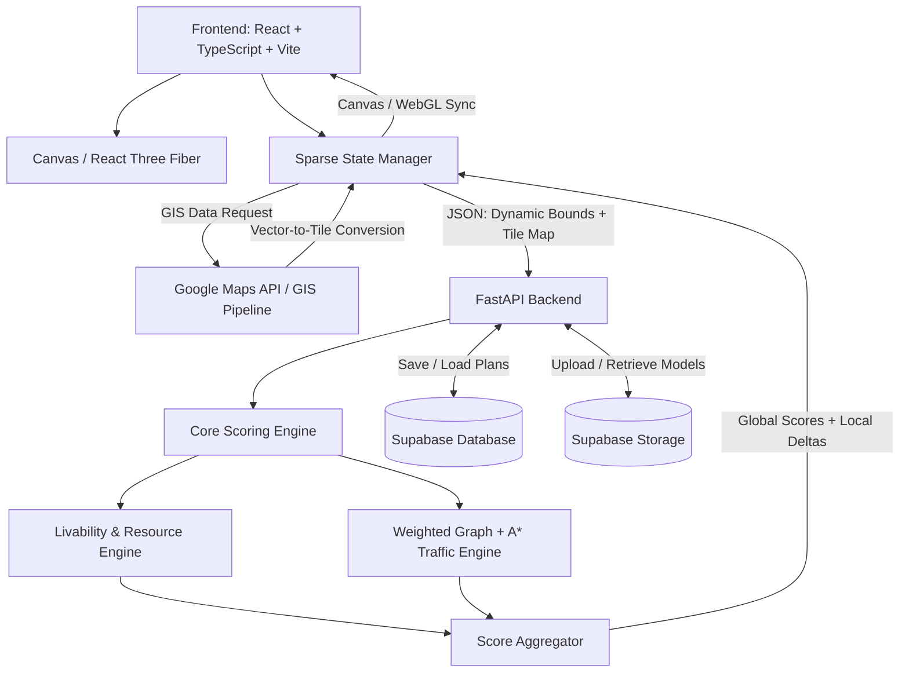

# MetroGrid — Advanced Edition
## Product Requirements Document (PRD)

**Version:** 1.0  
**Purpose:** Hackathon-ready, deterministic specification for AI coding agents and human developers  
**Target build window:** 48 hours  
**Primary goal:** Build an expandable, grid-based urban simulation and city-planning platform with real-time scoring, GIS ingestion, multi-tier roads, and optional custom 3D buildings.

---

## 1. Product Overview

**MetroGrid** is an interactive urban simulation and city-layout planner. Users design cities on an expandable sparse grid by placing residential, commercial, industrial, green, pedestrian, and road infrastructure tiles.

The application provides immediate algorithmic feedback on:

- Livability
- Traffic flow
- Resource accessibility

The advanced edition extends the original 20×20 prototype into an **infinite/extendable sparse coordinate grid**, adds GIS map ingestion, multi-tier road networks with weighted A* pathfinding, and support for `.gltf`/`.glb` custom building models rendered with React Three Fiber.

### 1.1 Core Goal

Provide a fast, visually understandable planning tool that lets users answer:

> "If I change this part of the city, how does the rest of the simulated community respond?"

### 1.2 Hackathon Goal

The implementation must remain deterministic, understandable, and demoable. AI coding agents must not introduce unnecessary dependencies, speculative services, heavyweight ORMs, or undocumented API routes.

---

# 2. Product Scope

## 2.1 MVP / Core Features

1. Interactive grid-based city planner.
2. Residential, commercial, green, industrial, and road placement.
3. Real-time scoring through FastAPI.
4. Livability, traffic, and resource scores normalized to 0–100.
5. A* road connectivity/pathfinding.
6. Local score feedback at the latest placement.
7. Save/load city layouts through Supabase.
8. Responsive dashboard with score bars.

## 2.2 Advanced Features

1. Sparse coordinate-map grid replacing the fixed 20×20 matrix.
2. Dynamic viewport/chunk rendering.
3. Signed 32-bit grid coordinates.
4. Google Maps-based bounding-box selection.
5. GIS building/road ingestion pipeline.
6. Latitude/longitude → discrete grid rasterization.
7. Multi-tier road subtypes.
8. Road-specific speed/capacity weights.
9. React Three Fiber / Three.js 3D rendering.
10. `.gltf` and `.glb` model uploads.
11. Supabase Storage asset hosting.
12. Tile-level custom model references.

---

# 3. System Architecture



---

# 4. Technology Stack

## 4.1 Frontend

- React 18+
- TypeScript
- Vite
- TailwindCSS
- Native HTML5 Canvas for 2D grid rendering
- React Three Fiber / Three.js for advanced 3D mode
- `@supabase/supabase-js` for client-side Supabase operations when appropriate

### Frontend directives

- Do not use Fabric.js, PixiJS, or another heavyweight 2D canvas abstraction.
- Keep grid state in a sparse coordinate map.
- Use chunking/viewport culling so off-screen tiles are not rendered.
- Avoid duplicating the authoritative city state across multiple stores.
- Canvas coordinate conversion must use `getBoundingClientRect()`.
- 3D rendering is an extension of the planner, not a requirement for the basic 2D workflow.

## 4.2 Backend

- Python 3.10+
- FastAPI
- Pydantic
- `supabase-py` where backend Supabase access is required

### Backend directives

- Validate every API payload with Pydantic.
- Keep algorithmic processing in active memory.
- Do not introduce a heavy ORM.
- Core calculations must be deterministic and synchronous for the scoring endpoint.
- Do not invent external APIs or routes beyond this specification.

## 4.3 Infrastructure

- Supabase PostgreSQL
- Supabase Storage
- Google Maps Platform for map selection/geocoding
- Optional Overpass/OpenStreetMap-compatible GIS pipeline for building footprints and road vectors, subject to API availability and applicable usage requirements.

---

# 5. Grid Architecture

## 5.1 Evolution from Prototype

The original prototype uses a fixed:

```text
20 × 20 number[][]
```

The Advanced Edition replaces this with:

```text
Map<string, TileObject>
```

The key format is:

```text
"x,y"
```

Example:

```json
{
  "10,-5": {
    "type": 1
  },
  "11,-5": {
    "type": 41
  }
}
```

The sparse map is the authoritative representation in Advanced Edition.

## 5.2 Coordinate System

Each tile uses signed 32-bit integer coordinates:

```text
x: -2147483648 to 2147483647
y: -2147483648 to 2147483647
```

Coordinates must remain integers.

No full matrix should be allocated for the entire coordinate range.

## 5.3 Tile Object

Base representation:

```typescript
interface TileObject {
  type: number;
  model_url?: string;
}
```

Example:

```json
{
  "x": 10,
  "y": -5,
  "type": 1,
  "model_url": "https://example.supabase.co/storage/v1/object/public/models/model.glb"
}
```

## 5.4 Tile Types

### Base Zones

| Type | Meaning |
|---:|---|
| 0 | Empty / Unzoned |
| 1 | Residential |
| 2 | Commercial |
| 3 | Green Space / Park |
| 5 | Heavy Industrial |

### Road Infrastructure

The original type `4` represents generic road infrastructure.

Advanced Edition introduces road subtypes:

| Type | Road | Speed Weight | Throughput |
|---:|---|---:|---|
| 40 | Pedestrian Path | 1 | Low |
| 41 | Local 2-Lane Road | 3 | Medium |
| 42 | 4-Lane Transit Avenue | 5 | High |
| 43 | Express Highway | 10 | Very High |

Type `4` may remain supported as a generic/legacy road type and should map to a sensible default road weight.

---

# 6. Viewport and Chunk Rendering

The application must not attempt to render the complete theoretical coordinate space.

## 6.1 Visible Bounds

The frontend calculates:

```text
minX
maxX
minY
maxY
```

from the current camera/canvas viewport.

Only tiles intersecting the active viewport should be rendered.

## 6.2 Chunking

The implementation should divide the sparse coordinate space into logical chunks.

A chunk may be represented by:

```text
chunkX = floor(x / CHUNK_SIZE)
chunkY = floor(y / CHUNK_SIZE)
```

`CHUNK_SIZE` should be configurable rather than hard-coded throughout the application.

## 6.3 Rendering Rules

- Empty tiles do not need persistent objects in the sparse map.
- Only visible chunks are rendered.
- Pan/zoom must not require rebuilding the entire city.
- Tile updates should invalidate only affected chunks where practical.

---

# 7. GIS / Google Maps Import

## 7.1 User Flow

1. User opens GIS import mode.
2. Google Maps widget displays the map.
3. User selects a rectangular geographic bounding box.
4. Frontend sends the bounds and desired grid origin to the backend.
5. Backend obtains building footprints and road polylines from the configured GIS pipeline.
6. Spatial rasterization converts geographic coordinates to integer grid coordinates.
7. Metadata is used to infer tile types.
8. Imported tiles are merged into the sparse grid.
9. The frontend renders the imported area.
10. Scores are recalculated.

## 7.2 Google Maps Integration

Required capabilities:

- Interactive map display.
- Bounding-box selection.
- Latitude/longitude bounds.
- Geocoding where required.

The application must not expose secret API keys in server-generated client code or source control.

## 7.3 GIS Processing Pipeline

```text
Google Maps / GIS Selection
        ↓
Bounding Box
        ↓
GIS Building + Road Data
        ↓
Vector Geometry
        ↓
Coordinate Transformation
        ↓
Grid Rasterization
        ↓
Tile Type Assignment
        ↓
Sparse Tile Map
```

## 7.4 Rasterization

The backend converts latitude/longitude coordinates into grid coordinates relative to:

```json
{
  "grid_origin": {
    "x": 0,
    "y": 0
  }
}
```

The transformation must be deterministic for the same bounds, origin, and source geometry.

## 7.5 Metadata Mapping

Initial mapping:

```text
Residential → type 1
Commercial → type 2
Green / Park → type 3
Generic Road → type 4
Pedestrian Path → type 40
Local Road → type 41
Transit Avenue → type 42
Express Highway → type 43
Industrial → type 5
```

Unknown GIS metadata must fall back safely rather than creating unsupported tile types.

---

# 8. Multi-Tier Road Network

## 8.1 Road Graph

The traffic engine constructs a weighted graph from connected road tiles.

Each traversable road tile becomes a graph node.

Adjacent compatible road tiles become graph edges.

## 8.2 Road Weights

Higher road speed weights represent faster traversal.

```text
40 → weight 1
41 → weight 3
42 → weight 5
43 → weight 10
```

The exact edge-cost formula may incorporate:

- Road speed weight
- Distance
- Capacity
- Congestion

but must remain deterministic.

## 8.3 Express Highway Restrictions

Type `43` is access-restricted.

A highway tile should not automatically be treated as accessible from every neighboring non-road tile.

Access should occur through valid road connections/ramps.

If ramps are represented explicitly in a future version, they must be modeled as their own tile type or connection metadata rather than inferred unpredictably.

---

# 9. Core Scoring Engine

The scoring endpoint must synchronously calculate the city metrics.

## 9.1 Score Categories

All scores are normalized to:

```text
0–100
```

Higher is better.

The dashboard displays:

- Livability
- Traffic
- Resources

## 9.2 Resource Connectivity

For every Residential tile (`1`):

1. Perform a Manhattan-distance scan.
2. Search for a Commercial tile (`2`) within a radius of 4.
3. If no Commercial tile is found:
   - Apply a `-20` resource penalty.

Manhattan distance:

```text
distance = abs(x1 - x2) + abs(y1 - y2)
```

## 9.3 Green-Space Modifier

For every Green Space (`3`):

- Residential zones within Manhattan radius 3 receive:
  - `+10 Livability`

## 9.4 Industrial Modifier

For every Heavy Industrial zone (`5`):

- Residential zones within Manhattan radius 4 receive:
  - `-15 Livability`

## 9.5 Traffic Connectivity

The engine must verify road connectivity between Residential and Commercial zones.

A Residential zone is considered connected when a valid road path can reach a Commercial zone.

For each Residential zone that cannot reach a Commercial zone:

```text
Traffic penalty = -5
```

## 9.6 Weighted A*

Traffic pathfinding uses an A* variant.

Conceptually:

```text
f(n) = g(n) + h(n)
```

where:

- `g(n)` = accumulated weighted road cost
- `h(n)` = admissible grid-distance heuristic adjusted for the road model

The implementation must not confuse road speed weight with a raw score bonus.

## 9.7 Congestion

Advanced traffic simulation should estimate congestion using:

```text
demand / capacity
```

where demand is derived from connected residential density and capacity is determined by road subtype.

Conceptual capacities:

```text
40 → Low
41 → Medium
42 → High
43 → Very High
```

Exact numeric capacity values should be centralized in configuration/constants.

---

# 10. Score Normalization

Raw scores must never be sent directly to the frontend.

Each metric must be clamped:

```text
normalized = max(0, min(100, normalized_value))
```

The normalization strategy must be consistent between requests.

The frontend should treat scores as:

```typescript
number // 0 to 100
```

---

# 11. Local Decision Feedback

Every scoring request includes the latest user action.

Example:

```json
{
  "x": 10,
  "y": -5,
  "type": 3
}
```

The backend returns a local delta describing the most relevant score change.

Example:

```json
{
  "x": 10,
  "y": -5,
  "value": 10,
  "metric": "livability"
}
```

The frontend displays feedback directly over the changed tile:

```text
+10 Livability
-15 Livability
+10 Resources
```

The feedback must:

1. Appear at the latest placement.
2. Float upward.
3. Fade out.
4. Avoid blocking subsequent interactions.

Implementation may use either:

- CSS keyframe animation over the canvas, or
- Canvas-rendered animated text.

---

# 12. API Contracts

## 12.1 Calculate Scores

### Endpoint

```http
POST /api/calculate
```

### Advanced Request

```json
{
  "active_bounds": {
    "min_x": -10,
    "max_x": 20,
    "min_y": -10,
    "max_y": 20
  },
  "tiles": {
    "0,0": {
      "type": 1
    },
    "0,1": {
      "type": 41
    },
    "0,2": {
      "type": 42
    }
  },
  "latest_action": {
    "x": 0,
    "y": 0,
    "type": 1
  }
}
```

### Response

```json
{
  "global_scores": {
    "livability": 82,
    "traffic": 74,
    "resources": 91
  },
  "local_deltas": {
    "x": 0,
    "y": 0,
    "value": 10,
    "metric": "livability"
  }
}
```

## 12.2 GIS Import

### Endpoint

```http
POST /api/gis/import
```

### Request

```json
{
  "bounds": {
    "north": 12.98,
    "south": 12.97,
    "east": 80.25,
    "west": 80.24
  },
  "grid_origin": {
    "x": 0,
    "y": 0
  }
}
```

### Response

```json
{
  "tiles_imported": 123,
  "updated_grid": {
    "0,0": {
      "type": 41
    },
    "1,0": {
      "type": 2
    }
  }
}
```

## 12.3 Asset Upload

### Endpoint

```http
POST /api/assets/upload
```

### Requirements

- Accept `.glb` and `.gltf`.
- Validate file type.
- Upload to Supabase Storage.
- Return a stable model URL/reference.
- Reject unsupported file types.
- Do not trust a client-provided MIME type alone.

### Tile Reference

```json
{
  "x": 10,
  "y": -5,
  "type": 1,
  "model_url": "https://.../model.glb"
}
```

---

# 13. Backward-Compatible Prototype API

The initial 20×20 prototype contract may be retained during migration.

### Prototype request

```json
{
  "grid_state": [
    [0, 0, 1],
    [0, 2, 4]
  ],
  "latest_placement": {
    "x": 0,
    "y": 0,
    "type": 1
  }
}
```

The migration layer may convert this matrix into sparse coordinates internally.

The Advanced Edition must use the sparse coordinate representation internally.

---

# 14. Frontend Interaction

## 14.1 Placement

The grid must support snap-to-grid placement.

Mouse/touch coordinates must be converted using:

```typescript
const rect = canvas.getBoundingClientRect();

const x = event.clientX - rect.left;
const y = event.clientY - rect.top;
```

These pixel coordinates are then transformed into world/grid coordinates based on:

- camera offset
- zoom
- tile size

## 14.2 Placement Flow

```text
Pointer Event
    ↓
Canvas Bounding Rect
    ↓
Screen → World Coordinates
    ↓
World → Integer Grid Coordinates
    ↓
Update Sparse Map
    ↓
POST /api/calculate
    ↓
Receive Scores + Delta
    ↓
Update Dashboard
    ↓
Animate Local Feedback
```

## 14.3 Interaction States

The UI should support at minimum:

- Select tile type
- Place tile
- Erase tile
- Pan viewport
- Zoom viewport
- Save layout
- Load layout
- GIS import
- Optional 3D model placement

---

# 15. Dashboard

The dashboard is top-aligned and displays:

```text
Livability    █████████░ 82
Traffic       ███████░░░ 74
Resources     █████████░ 91
```

## 15.1 Score Colors

| Score | Status |
|---:|---|
| 0–40 | Red |
| 41–75 | Yellow |
| 76–100 | Green |

Do not hard-code these thresholds in multiple components. Define them once.

---

# 16. 3D Rendering

## 16.1 Rendering Stack

Advanced mode uses:

- React Three Fiber
- Three.js
- GLTF/GLB loaders

## 16.2 Model Lifecycle

```text
User selects model
      ↓
POST /api/assets/upload
      ↓
Supabase Storage
      ↓
Model URL
      ↓
TileObject.model_url
      ↓
3D Tile Renderer
      ↓
GLTF/GLB displayed at grid coordinate
```

## 16.3 Performance

The renderer must:

- Load models lazily where practical.
- Avoid creating duplicate model instances unnecessarily.
- Dispose resources when no longer needed.
- Keep 2D planning usable even if a model fails to load.

A failed 3D asset must not corrupt the city state.

---

# 17. Supabase Database

## 17.1 `city_plans`

Required table:

| Column | Type | Requirements |
|---|---|---|
| `id` | uuid | Primary key |
| `name` | text | User-visible layout name |
| `grid_state` | jsonb | Sparse tile map |
| `created_at` | timestamp | Creation timestamp |

Recommended future columns:

- `updated_at`
- `user_id`
- `version`
- `metadata`

Do not add these unless required by authentication or collaboration scope.

## 17.2 Example Stored State

```json
{
  "0,0": {
    "type": 1
  },
  "0,1": {
    "type": 41
  },
  "1,1": {
    "type": 3
  }
}
```

## 17.3 Save Layout

UI:

```text
[ Layout Name ] [ Save Layout ]
```

The save operation stores the current sparse tile map.

## 17.4 Load Layout

UI:

```text
[ Select Saved Layout ▼ ]
```

Selecting a layout replaces the current in-memory city state after confirmation if unsaved changes exist.

---

# 18. Supabase Storage

Recommended bucket:

```text
models
```

Storage is used for:

- `.glb`
- `.gltf`
- associated model assets where required

The database stores references/URLs rather than binary model data.

---

# 19. State Management

The application should maintain one authoritative city state:

```typescript
type GridState = Map<string, TileObject>;
```

Derived state may include:

- visible tiles
- active chunks
- current scores
- selected tool
- viewport
- transient feedback animations

Do not store derived values redundantly when they can be calculated cheaply.

---

# 20. Error Handling

## 20.1 Frontend

The UI must gracefully handle:

- Backend unavailable
- GIS import failure
- Invalid placement
- Invalid model
- Model loading failure
- Save failure
- Load failure
- Invalid API response

Errors should be visible to the user without crashing the planner.

## 20.2 Backend

FastAPI must return appropriate HTTP status codes.

Suggested conventions:

```text
400 → Invalid request
404 → Resource not found
413 → Asset too large
422 → Pydantic validation failure
500 → Unexpected server failure
```

Do not expose stack traces or secrets to the client.

---

# 21. Determinism Requirements

Given identical:

- tile state
- active bounds
- latest action
- GIS input

the scoring engine must return identical results.

Avoid:

- random scoring
- time-dependent scoring
- hidden global state
- non-deterministic iteration where it affects results

Constants and weights must be centralized.

---

# 22. Security Requirements

1. Never expose Supabase service-role keys to the frontend.
2. Never expose private Google API credentials.
3. Validate all uploaded model types.
4. Enforce reasonable upload size limits.
5. Sanitize layout names.
6. Validate coordinates.
7. Validate tile types against the supported enum.
8. Apply Supabase Row Level Security if user-specific layouts are introduced.
9. Do not trust client-calculated scores.
10. Backend scores are authoritative.

---

# 23. Suggested Backend Structure

```text
backend/
├── app/
│   ├── main.py
│   ├── api/
│   │   ├── calculate.py
│   │   ├── gis.py
│   │   └── assets.py
│   ├── models/
│   │   ├── tiles.py
│   │   └── requests.py
│   ├── services/
│   │   ├── scoring.py
│   │   ├── resources.py
│   │   ├── traffic.py
│   │   ├── pathfinding.py
│   │   ├── rasterizer.py
│   │   └── gis.py
│   └── config.py
└── tests/
```

The exact module organization may vary, but responsibilities should remain separated.

---

# 24. Suggested Frontend Structure

```text
frontend/
├── src/
│   ├── components/
│   │   ├── CityCanvas/
│   │   ├── CityScene3D/
│   │   ├── Dashboard/
│   │   ├── TilePalette/
│   │   ├── SaveLoad/
│   │   └── GISImport/
│   ├── state/
│   │   └── cityState.ts
│   ├── services/
│   │   ├── api.ts
│   │   └── supabase.ts
│   ├── types/
│   │   └── city.ts
│   ├── utils/
│   │   ├── coordinates.ts
│   │   └── chunks.ts
│   └── App.tsx
```

---

# 25. Testing Requirements

## 25.1 Backend Unit Tests

Test at minimum:

1. Manhattan distance.
2. Residential → Commercial resource detection.
3. Green-space livability bonus.
4. Industrial livability penalty.
5. Road connectivity.
6. A* pathfinding.
7. Road weighting.
8. Highway restrictions.
9. Score normalization.
10. Invalid tile rejection.
11. GIS coordinate rasterization.
12. Sparse-map serialization.

## 25.2 Frontend Tests

Test:

1. Screen → grid coordinate conversion.
2. Snap-to-grid behavior.
3. Tile placement.
4. Tile deletion.
5. Viewport culling.
6. Save/load state handling.
7. Score display thresholds.
8. Floating feedback animation state.

## 25.3 Integration Tests

At minimum:

```text
Place Residential
    ↓
Calculate
    ↓
Score updates

Place Commercial nearby
    ↓
Calculate
    ↓
Resources improve

Place Green Space nearby
    ↓
Calculate
    ↓
Livability improves

Disconnect residential road
    ↓
Calculate
    ↓
Traffic decreases
```

---

# 26. Performance Requirements

The system should prioritize smooth interaction.

## Frontend

Target:

```text
60 FPS during normal viewport interaction
```

Use:

- Sparse state
- Chunking
- Viewport culling
- Minimal React re-renders
- Canvas batching
- Lazy 3D model loading

## Backend

The `/api/calculate` endpoint should be optimized around the active bounds rather than scanning the theoretical 32-bit coordinate space.

For large cities, scoring algorithms should avoid repeated full-map scans where cached/derived structures can safely reduce work.

---

# 27. Demo Workflow

The 48-hour hackathon demo should follow a simple narrative.

## Demo 1 — Build

1. Place residential zones.
2. Place commercial zones.
3. Add roads.
4. Add parks.
5. Observe live score changes.

## Demo 2 — Break the City

1. Add heavy industry near residences.
2. Disconnect roads.
3. Show livability and traffic degradation.

## Demo 3 — Optimize

1. Add green spaces.
2. Improve road hierarchy.
3. Connect residences to commercial areas.
4. Show score recovery.

## Demo 4 — GIS Import

1. Select an area on Google Maps.
2. Import the area.
3. Show automatically generated roads/buildings.
4. Continue editing the imported city.

## Demo 5 — 3D

1. Upload a `.glb` building.
2. Place it on a tile.
3. Show the building in 3D mode.
4. Demonstrate that scoring still works independently of the visual model.

---

# 28. AI Coding Agent Directives

AI agents implementing MetroGrid must follow these rules.

## MUST

- Follow the API contracts exactly.
- Use TypeScript on the frontend.
- Use FastAPI + Pydantic on the backend.
- Use sparse coordinate state for Advanced Edition.
- Keep scoring deterministic.
- Validate all external input.
- Keep secrets server-side.
- Keep the scoring engine independent from rendering.
- Preserve backward compatibility during migration where practical.
- Write tests for scoring and pathfinding.
- Reuse existing dependencies before adding new ones.

## MUST NOT

- Invent API routes.
- Invent undocumented database tables.
- Add an ORM for the scoring engine.
- Replace native Canvas with Fabric.js/PixiJS.
- Allocate a gigantic full-coordinate matrix.
- Put Supabase service-role credentials in client code.
- Treat road speed weights as arbitrary score bonuses.
- Make score calculations client-authoritative.
- Add random behavior to scoring.
- Introduce microservices without a concrete requirement.
- Add an AI/LLM scoring layer unless explicitly requested.

---

# 29. Definition of Done

MetroGrid Advanced Edition is considered complete when:

- [ ] Users can place and delete tiles.
- [ ] Sparse coordinates work beyond a 20×20 matrix.
- [ ] Panning/zooming works over the expandable grid.
- [ ] Only relevant viewport/chunk data is rendered.
- [ ] `/api/calculate` accepts the Advanced Edition contract.
- [ ] Livability scoring works.
- [ ] Resource proximity scoring works.
- [ ] Traffic connectivity works.
- [ ] Weighted A* pathfinding works.
- [ ] Scores are normalized to 0–100.
- [ ] Local score feedback appears over placements.
- [ ] Dashboard score colors follow the specified thresholds.
- [ ] Layouts can be saved to Supabase.
- [ ] Layouts can be loaded from Supabase.
- [ ] GIS bounding-box import works with the configured GIS source.
- [ ] Imported GIS data rasterizes into grid coordinates.
- [ ] Road subtypes 40–43 are supported.
- [ ] `.glb` / `.gltf` assets can be uploaded.
- [ ] Uploaded models can be associated with tiles.
- [ ] 3D rendering does not break the core planner.
- [ ] Invalid requests and uploads are rejected safely.
- [ ] Core scoring/pathfinding tests pass.
- [ ] The full demo workflow can be completed reliably.

---

# 30. Future Extensions

These are explicitly out of the initial 48-hour scope unless time permits:

- Multiplayer collaboration.
- Real-time city synchronization.
- Procedural building generation.
- Public city sharing.
- Historical traffic simulation.
- Time-of-day demand modeling.
- Population simulation.
- Public transit routing.
- Economic simulation.
- Weather/environment simulation.
- AI-assisted city recommendations.
- Advanced terrain/elevation.
- Full GIS editing tools.

These features must not be implemented at the expense of the core requirements.

---

# 31. Final Architecture Principle

MetroGrid should remain a **simulation engine with a visual interface**, not a collection of disconnected UI features.

The authoritative flow is:

```text
User Action
    ↓
Sparse City State
    ↓
Validated API Request
    ↓
Deterministic Scoring Engine
    ├── Resource Proximity
    ├── Livability Modifiers
    └── Weighted Road/A* Traffic
    ↓
Normalized Global Scores
    +
Local Score Delta
    ↓
Frontend Visualization
```

GIS and 3D assets extend the city representation without changing the fundamental scoring model.

The architecture must therefore preserve a clean separation between:

```text
CITY STATE
    ↓
SIMULATION
    ↓
SCORES
    ↓
VISUALIZATION
```

That separation is the core design constraint of MetroGrid.
